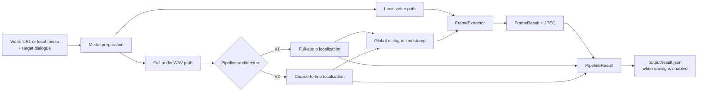
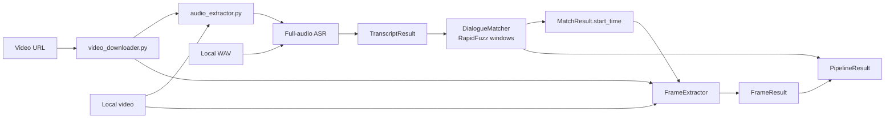
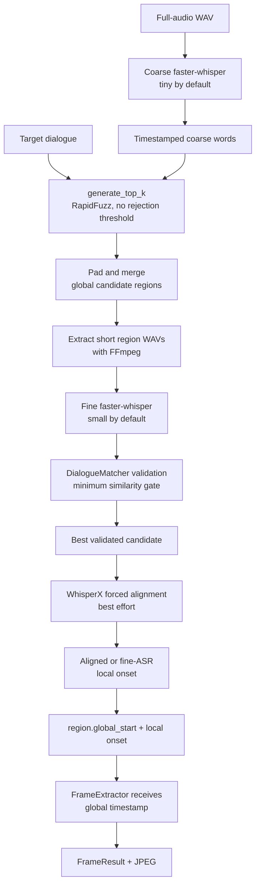
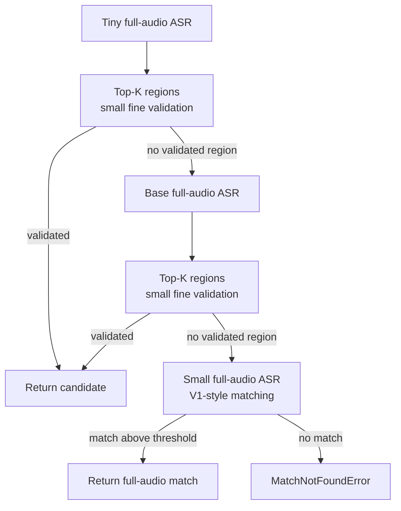

# Video Dialogue Localization Architecture

## 1. System Overview

The system locates a target spoken phrase in a video and extracts the video frame corresponding to the detected dialogue onset. It can run as a command-line pipeline or through a lightweight local web interface.

| Boundary | Data |
|---|---|
| Input | Public video URL or local video/WAV media, plus target dialogue text |
| Output | Matched transcript text, dialogue timestamp, frame number, extracted JPEG frame, match confidence, and media metadata |

`pipeline.py` exposes the two main Python entry points: `run_pipeline()` for V1 and `run_pipeline_v2()` for the coarse-to-fine flow. Both return a `PipelineResult` and optionally persist it to `output/result.json`.

## 2. High-Level Architecture

The pipeline separates media preparation from localization. `video_downloader.py` and `audio_extractor.py` produce reusable local media. The selected localization path then derives a global dialogue timestamp, which `frame_extractor/` converts to a frame and JPEG image. `pipeline.py` combines all stage results into the final output.



The main responsibilities are divided among media acquisition, audio extraction, ASR, lexical matching, V2 candidate localization and alignment, frame extraction, orchestration, and presentation.

## 3. V1 Architecture

V1 is the baseline full-audio path implemented by `pipeline.run_pipeline()`. It transcribes the complete WAV once using the selected ASR provider and model, then passes the timestamped words directly to `DialogueMatcher`. The best match onset is already in full-media time and is sent to `FrameExtractor`.



V1 supports the ASR providers registered in `asr/factory.py`: `faster-whisper`, OpenAI Whisper, and WhisperX. It is retained as a direct reference path and its full-audio matching behavior is reused by V2's final fallback.

## 4. V2 Coarse-to-Fine Architecture

V2 is implemented by `pipeline.run_pipeline_v2()` and `localizer.cascade.run_cascade()`. Its default coarse tiers are `tiny` followed by `base`, and its default fine model is `small`. Unlike V1's selectable provider, V2's `_transcribe()` helper uses `faster-whisper` for coarse, fine, and final full-audio ASR.

For each coarse tier:

1. The full WAV is transcribed to timestamped words.
2. `generate_top_k()` scores target-sized word windows with RapidFuzz and retains diverse Top-K candidates. No similarity threshold rejects candidates at this stage.
3. `pad_and_merge()` adds a configurable margin, clamps to the audio duration, and merges overlapping regions.
4. `extract_region_wavs()` uses FFmpeg to cut a short WAV for each global region.
5. The fine model transcribes each short WAV. `DialogueMatcher` applies the configured minimum similarity and ranks valid results by similarity and word probabilities.
6. The highest-ranked validated region wins.
7. `asr/aligner.py` attempts WhisperX forced alignment on only the winning WAV. If alignment is unavailable or fails, the fine-ASR onset is retained.
8. The winning local onset is converted back to full-media time and passed to `FrameExtractor`.



The coarse and fine model names, Top-K count, region margin, language, device, and compute type are configurable through `run_pipeline_v2()` and the CLI. Temporary `regions/region_*.wav` files are removed after success unless `keep_regions` is enabled.

## 5. Module Responsibilities

| Module | Input | Responsibility | Output |
|---|---|---|---|
| `video_downloader.py` | Public video URL, optional proxy | Downloads one video with `yt-dlp`, retries failures, and merges to MP4 when FFmpeg is available | Local video `Path` |
| `audio_extractor.py` | Local video path | Uses FFmpeg to remove video and write PCM WAV audio | WAV `Path` |
| `asr/transcriber.py`, `asr/factory.py` | WAV path and model configuration | Provide the model-agnostic `Transcriber` facade and select an ASR provider | `TranscriptResult` |
| `asr/providers/` | WAV path | Implement faster-whisper, OpenAI Whisper, and WhisperX transcription behind `BaseASRProvider` | Timestamped `TranscriptResult` |
| `matcher/core.py` | Target text and timestamped words or transcript JSON | Normalizes text, builds N-2 through N+2 word windows, scores them with RapidFuzz, and enforces a similarity threshold | `MatchResult` with ranked candidates |
| `localizer/core.py` | Coarse words, target, and full WAV | Generates Top-K `CandidateRegion` objects, pads/merges them, extracts region WAVs, cleans temporary files, and formats final timestamps | Global regions and region WAV paths |
| `localizer/cascade.py` | Full WAV, target, cascade configuration | Runs V2 coarse tiers, fine validation, alignment, and full-audio fallback | `CascadeResult` with a global timestamp |
| `asr/aligner.py` | Winning region WAV and fine transcript | Uses WhisperX to refine word timestamps and locate the matched phrase onset; degrades to no refinement on failure | Refined local onset or `None` |
| `frame_extractor/core.py` | Video path and global timestamp | Reads metadata with ffprobe, maps time to a frame index, seeks with FFmpeg, and writes a JPEG | `FrameResult` |
| `pipeline.py` | URL/local media, target, runtime options | Resolves cached media, orchestrates V1 or V2, translates stage errors, and combines results | `PipelineResult`, optionally `output/result.json` |
| `webapp/main.py`, `webapp/jobs.py` | URL and target from HTTP | Run V2 in one background worker, track progress in memory, expose polling results, and serve static assets/frames | Job-status JSON and frame URL |

The main package-level public APIs are `asr.Transcriber`, `matcher.DialogueMatcher`, `localizer.run_cascade`, and `frame_extractor.FrameExtractor`, in addition to the two pipeline functions.

## 6. Data Flow

| Representation | Produced by | Meaning / next consumer |
|---|---|---|
| Video path | `download_video()` or `_prepare_media()` | Local source video consumed by audio and frame extraction |
| WAV path | `extract_audio()` or cached input | Full audio consumed by V1 ASR or the V2 cascade |
| `TranscriptResult` | An ASR provider | Metadata plus a flat list of `asr.models.Word` values |
| Timestamped words | `TranscriptResult.words` | Text, start, end, and probability used by matching/localization |
| `CandidateRegion` | `generate_top_k()`, then `pad_and_merge()` | Full-audio `global_start`/`global_end`, coarse similarity, source rank, and coarse word indices |
| Region WAV pair | `extract_region_wavs()` | `(CandidateRegion, Path)` connecting a short local-time clip to its global offset |
| Fine `MatchResult` | `DialogueMatcher.find_best_match_in_words()` | Validated text, local start/end, similarity, probabilities, and matched words |
| Aligned local timestamp | `match_refined_onset()` | Optional refined phrase onset within the winning region WAV |
| Global timestamp | `run_cascade()` | Region offset plus local onset; direct full-audio onset in the final fallback |
| `FrameResult` | `FrameExtractor.extract_at_timestamp()` | Requested/actual timestamp, frame number, JPEG path, FPS, duration, dimensions, and optional frame count |
| `PipelineResult` | `run_pipeline()` or `run_pipeline_v2()` | Final combined localization, frame, media, confidence, and V2 cascade metadata |

V1 persists its full transcript to `transcript/transcript.json`. V2 operates on cascade results in memory; `PipelineResult.transcript_path` retains the common output field, but the V2 cascade does not write a new full transcript to that path.

## 7. Timestamp Handling

Timestamp coordinate systems are explicit in V2:

- Coarse words are transcribed from the full WAV, so their timestamps are global.
- `CandidateRegion.global_start` and `global_end` remain in full-audio time. After padding and merging, `global_start` is also the offset supplied to FFmpeg when cutting the region.
- Fine ASR runs on an extracted region WAV. Its word timestamps and `MatchResult.start_time` are therefore local to that region.
- Forced alignment also runs on the region WAV and returns local word times.
- The final timestamp is calculated as:

```text
global dialogue onset = winner_region.global_start + local dialogue onset
```

For example, if a region begins at `318.250000` seconds in the full audio and alignment places the phrase at `6.740` seconds inside the region, the timestamp supplied to frame extraction is `324.990` seconds.

The pipeline carries timestamps as float seconds and does not apply display formatting during local-to-global conversion. ASR/alignment word times have the millisecond precision produced by their providers, while FFmpeg seek values for region and frame extraction are serialized to six decimal places. `format_timestamp()` is used only when producing the final `HH:MM:SS.sss` representation. `FrameExtractor` always receives the global timestamp, computes `floor(timestamp * fps)`, derives that frame's presentation time, and extracts the JPEG at the derived frame time.

In V1 and V2's full-audio fallback, the match onset is already global, so no region offset is added.

## 8. Fallback Architecture

Each coarse tier uses the same full-audio WAV; fallback does not download the video or extract audio again. With the default configuration, the ladder is:



Empty coarse transcripts, missing candidate regions, or fine matches below the threshold advance to the next tier. Region-extraction errors are reported rather than treated as a match miss. Forced-alignment failure does not advance the ladder: the already validated fine-ASR timestamp is used.

## 9. Web Architecture

`webapp/main.py` is a thin FastAPI wrapper around `run_pipeline_v2()`:

- `POST /api/localize` validates a URL and target, claims the single worker slot, creates a job, and starts a daemon thread.
- The worker forwards pipeline progress and logs to `JobStore` in `webapp/jobs.py`.
- `GET /api/jobs/{job_id}` returns a thread-safe snapshot containing stage state, logs, elapsed time, errors, or the final result.
- `webapp/static/index.html`, `app.js`, and `style.css` provide the polling frontend.
- `/frames` serves extracted images, while `/static` serves frontend assets.

Job state is in memory and only one pipeline job can run at a time. `run_server.bat` starts Uvicorn on port 8000.

## 10. Architectural Properties / Design Principles

- **Recall first:** the coarse stage ranks diverse Top-K windows without a rejection threshold, reducing the chance that an imperfect cheap transcript removes the correct region.
- **Precision second:** the fine model re-transcribes short regions and `DialogueMatcher` applies the actual similarity gate using text and word confidence for ranking.
- **Timestamp refinement:** forced alignment is applied only to the winning region and is non-fatal.
- **Recoverable cascade:** default tiny and base tiers lead to fixed full-audio small/V1-style matching before `MatchNotFoundError`.
- **CPU-first defaults:** both pipeline APIs default to `device="cpu"`; faster-whisper defaults to `int8` on CPU.
- **Separable components:** ASR providers share one facade, matching is independent of transcription, and frame extraction consumes only a video path and global timestamp.
- **Reusable media:** URL download and audio extraction are skipped when valid local paths are supplied.

## 11. Project Structure

```text
quest1_project/
├── pipeline.py                 # V1/V2 orchestration and PipelineResult
├── video_downloader.py         # yt-dlp acquisition
├── audio_extractor.py          # Full-audio WAV extraction
├── benchmark_v1_v2.py          # V1/V2 runtime comparison entry point
├── asr/
│   ├── transcriber.py          # Transcriber facade
│   ├── factory.py              # Provider selection
│   ├── models.py               # Word and TranscriptResult
│   ├── aligner.py              # Best-effort WhisperX alignment
│   └── providers/              # faster-whisper, Whisper, WhisperX
├── matcher/
│   └── core.py                 # Normalization, windows, RapidFuzz matching
├── localizer/
│   ├── core.py                 # Candidate regions and region WAV handling
│   └── cascade.py              # V2 tiers, validation, and fallback
├── frame_extractor/
│   └── core.py                 # Metadata, frame mapping, JPEG extraction
├── webapp/
│   ├── main.py                 # FastAPI routes and background worker
│   ├── jobs.py                 # In-memory job store
│   └── static/                 # HTML, CSS, and JavaScript frontend
├── tests/                      # Unit and orchestration tests
├── run_server.bat              # Local Uvicorn launcher
└── output/result.json          # Default persisted pipeline result
```
